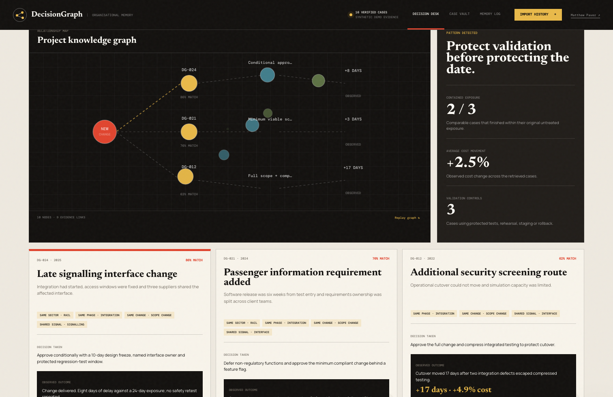

# DecisionGraph

**What happened last time?**

DecisionGraph — the precedent-retrieval demonstrator inside [ProjectLens Project Change Assurance](https://matthewpaver.github.io/ProjectLens/change-assurance.html) — is for the reviewer approving a project change who knows the organisation has seen this before, but can't find where: it retrieves comparable cases, shows why each one matches, and connects the intervention chosen to the outcome that followed.

## The problem

PMI described lessons-learned knowledge bases as frequently populated but infrequently accessed, leaving critical knowledge underused ([Knowledge is power](https://www.pmi.org/learning/library/knowledge-power-implementing-lessons-learned-6663)). Teams dutifully write lessons down at project close; nobody consults them at the moment a change is being approved. The cost is concrete: the same schedule mistake gets approved twice, because the record of the first time was findable in principle and invisible in practice.

## Who it's for

Change reviewers working inside ProjectLens's change-assurance flow. When a reviewer asks for supporting evidence on a proposed change, DecisionGraph supplies the precedent; the workflow keeps comparable cases collapsed until a reviewer asks for them.

## What you get

- The three most comparable historical cases for the change under review
- A visible match reason for every retrieved case — no unexplained rankings
- An explicit problem → decision → outcome chain for each precedent, so the reviewer sees what was done and what it cost or saved
- An evidence-linked recommendation with explicit boundaries, and a memory log that records the human decision



[](https://github.com/MatthewPaver/DecisionGraph/actions/workflows/deploy-pages.yml)

## Live workflow

1. Describe a new change or delivery problem.
2. Add sector, project phase, change type and schedule exposure.
3. Retrieve the three most comparable historical cases.
4. Inspect the match explanation and project knowledge graph.
5. Compare the intervention and measured outcome from each precedent.
6. Review an evidence-linked recommendation with explicit boundaries.
7. Record a human decision and add the eventual outcome back into memory.

The public demo includes 16 synthetic cases across rail, energy, buildings, water, aviation, infrastructure and digital delivery. JSON and CSV files can be imported locally in the browser. Imported data is not sent to a server.

## Retrieval design

This version deliberately separates deterministic retrieval from generative synthesis:

- token-overlap similarity over problem, context, risks and intervention
- exact weighted matches for sector, phase and change type
- visible match reasons for every retrieved case
- explicit graph edges from problem to decision to outcome
- recommendation language constrained to retrieved evidence
- mandatory human review before a proposal enters the memory log

Ranking behaviour is verified in CI ([`tests/retrieval.test.cjs`](tests/retrieval.test.cjs)): Node tests assert that a case matching sector, phase and change type outranks a text-only match, that ranking is deterministic and respects the result limit, and that generic change words are excluded from tokens. A separate static suite checks that all 16 demo cases carry schedule, cost and evidence outcomes.

## Why this design

Retrieval here is transparent token-overlap scoring rather than an embedding model, and that is a choice, not a shortcut. The user is a reviewer being asked to sign their name to a change; every match reason must be inspectable — "same sector, same phase, shared terms: possession overrun, resignalling" is an argument the reviewer can check, where a cosine similarity of 0.83 is not. That inspectability is the point of the evidence UX: the match explanation and the problem → decision → outcome chain are the product, not decoration around a ranking. The trade-off is accepted and real: token overlap has no semantic recall, so a precedent described in different vocabulary will be missed. A production version would add evaluated semantic embeddings for recall while keeping the visible-reason contract for anything it shows the reviewer.

## Non-goals

- **Not real retrieval at scale.** Matching is token overlap over 16 synthetic cases — enough to demonstrate the evidence UX, not to prove recall on a real corpus.
- **Not a knowledge base.** There is no durable storage, access control, document-level permissioning or source-quality checking; imported data lives only in the browser.
- **Not a finished component.** This is a demonstrator whose production version would replace each part: token overlap with evaluated semantic embeddings, the template recommendation with a model-backed synthesis stage, and the demo memory log with durable storage, evaluation datasets and governance controls.

## Research basis

- PMI described lessons-learned knowledge bases as frequently populated but infrequently accessed, leaving critical knowledge underused: [Knowledge is power](https://www.pmi.org/learning/library/knowledge-power-implementing-lessons-learned-6663).
- A 2026 study evaluated semantic embeddings, vector similarity, local language models and context filtering against keyword search. It reported substantially improved retrieval relevance while noting source-document quality and processing-time trade-offs: [Improving Lessons Learned Retrieval in Project-based Organizations through Retrieval-Augmented Generation](https://doi.org/10.1016/j.procs.2026.03.192).

## Run locally

```bash
python3 -m http.server 4173 --directory docs
```

Then open `http://127.0.0.1:4173`.

## Verify

```bash
node --check docs/app.js
node --check docs/cases.js
python3 -m unittest discover tests
```

## Model boundary

This is a synthetic portfolio demonstrator, not an autonomous change-control system. Its output is a proposal for professional review. It does not replace contractual, safety, engineering, commercial or governance approval.

## License

MIT
